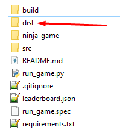

# Ninja Fighter Game


Увлекательная 2D файтинг-игра с ниндзя, написанная на Python с использованием библиотеки Pygame.

## 🎮 Особенности игры

- **Два режима игры**: одиночная игра против ИИ и локальный мультиплеер
- **Динамические анимации**: полноценные спрайт-анимации для всех действий
- **Система комбо**: цепочки атак для опытных игроков
- **Специальные способности**: сюрикены, режим берсеркера
- **Разрушаемые объекты**: ящики и вазы для тактических преимуществ
- **Система бревен**: уникальная механика прыжков по платформам
- **Случайные фоны**: каждый бой проходит на новом фоне
- **Звуковые эффекты**: полное звуковое сопровождение
- **Таблица лидеров**: отслеживание достижений

## 🎯 Управление

### Игрок 1 (левый):
- **A / D** - движение влево/вправо
- **W** - прыжок
- **S** - блокировка / спрыгивание с бревна (двойное нажатие)
- **B** - атака мечом
- **V** - бросок сюрикена
- **N** - режим берсеркера
- **W + V** - бросок сюрикена вверх

### Игрок 2 (правый):
- **← / →** - движение влево/вправо
- **↑** - прыжок
- **↓** - блокировка / спрыгивание с бревна (двойное нажатие)
- **Numpad 2** - атака мечом
- **Numpad 1** - бросок сюрикена
- **Numpad 3** - режим берсеркера
- **↑ + Numpad 1** - бросок сюрикена вверх

### Общие клавиши:
- **ESC** - пауза/меню
- **R** - перезапуск боя (после окончания)

## 🚀 Быстрый старт

### Системные требования
- Python 3.11+ (поддержка 3.13 экспериментальна)
- Pygame>=2.6.1
- Numpy>=2.0.0
- Scipy>=1.11.3
- PyInstaller>=6.10.0

### Установка и запуск
1. Клонируйте репозиторий:
```bash
git clone https://github.com/UpDate0909/ninja-fighter-game.git
cd ninja-fighter-game
```
Установите зависимости:
```bash
pip install -r requirements.txt
```
Запустите игру:
```bash
python run_game.py
```

Сборка .exe
Если хотите получить *.exe файл:

Установите PyInstaller:
```bash
pip install pyinstaller>=6.10.0
```
Создайте EXE файл:
```bash
pyinstaller --onefile --windowed --add-data "ninja_game;ninja_game" --add-data "src;src" --icon=ninja_game/assets/icon.ico run_game.py
```
Готовый файл появится в папке `dist/`



🎨 Кастомизация фонов

Игра поддерживает случайные фоны для каждого боя! Чтобы добавить свои фоны:
Поместите изображения в папку `ninja_game/assets/fons/`
Поддерживаемые форматы: PNG, JPG, JPEG, BMP, TGA
Рекомендуемый размер: 800x600 пикселей
Советы: Избегайте слишком ярких изображений, которые могут мешать видимости персонажей
📁 Структура проекта
```bash
ninja-fighter-game/
├── ninja_game/
│   └── assets/
│       ├── fons/          # Фоновые изображения (добавьте свои!)
│       ├── sounds/        # Звуковые эффекты
│       └── sprites/       # Спрайты персонажей
├── src/
│   ├── components/        # Игровые компоненты
│   └── main.py            # Основной игровой модуль
├── run_game.py            # Скрипт запуска
└── requirements.txt       # Зависимости
```

🐛 Устранение неполадок

Игра не запускается
Убедитесь, что установлен Python 3.11+
Проверьте установку Pygame: `pip install pygame`

Нет звука
Проверьте настройки звука в игре
Убедитесь, что файлы в `ninja_game/assets/sounds/` не повреждены

Низкая производительность
Закройте другие приложения
Уменьшите количество фоновых изображений в папке `fons`

🤝 Вклад в проект

Вклад в развитие игры приветствуется! Вы можете:
Добавлять новые фоны в папку `fons`
Сообщать об ошибках через Issues
Предлагать новые функции
Улучшать код через Pull Requests

📄 Лицензия

Этот проект распространяется под лицензией MIT. См. файл LICENSE для подробностей.

🎯 Планы развития

•	 Онлайн мультиплеер

•	 Новые персонажи

•	 Дополнительные способности

•	 Турнирный режим

•	 Редактор уровней

Совместимость: Игра протестирована на Windows 10. Для других ОС могут потребоваться дополнительные настройки.
Зависимости: Убедитесь, что установлены все библиотеки из requirements.txt.
Поддержка: Создайте issue, если возникнут вопросы или проблемы.

📬 Контакты

Автор: [](https://github.com/UpDate0909)

Наслаждайтесь игрой. Да прибудет с Вами сила!
